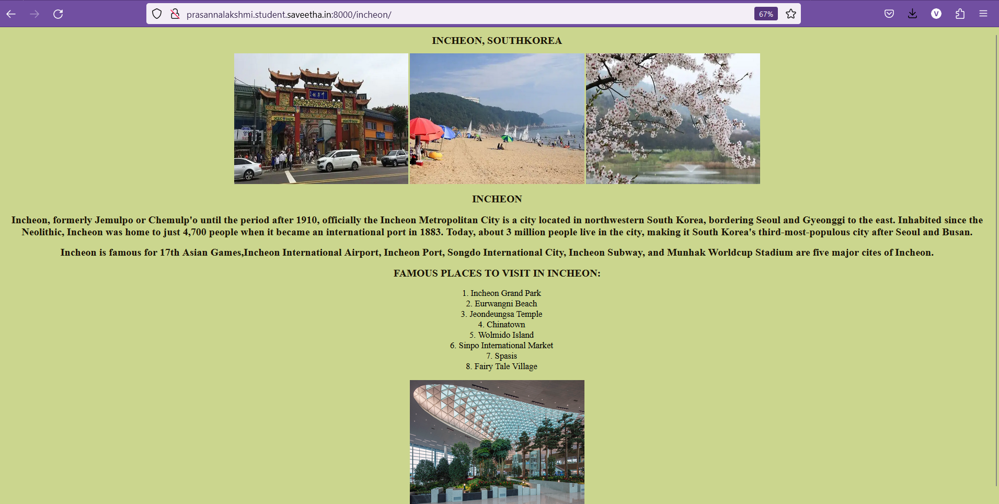

# Places Around Me
## AIM:
To develop a website to display details about the places around my house.

## Design Steps:

### Step 1:
Clone the github repository into Theia IDE.
### Step 2:
Create a new Django project
### Step 3:
Write the needed HTML code.
### Step 4:
Run the Django server and execute the HTML files.

## Code:
```
<!DOCTYPE html>
<html lang="en">
    <head>
        <title> SOUTH KOREA MAP </title>
    </head>
    <body style="background-color:black ;">
        
        <div style="text-align: center;">
       </div>
<MAP name= "southkorea">
    <area shape="RECT" coords="1037,564,1134,630" alt="busan" title="busan" href="/busan/">
    <area shape="RECT" coords="766,94,844,154" alt="seoul" title="seoul" href="/seoul/">
    <area shape="RECT" coords="658,149,757,211" alt="incheon" title="incheon" href="/incheon/">  
    <area shape="RECT" coords="974,410,1057,470" alt="daegu" title="daegu" href="/daegu/">
</map>
    </body>
</html> 
```

## Output:





## Result:
Thus A website to display details about the places in map is successfully executed and displayed.